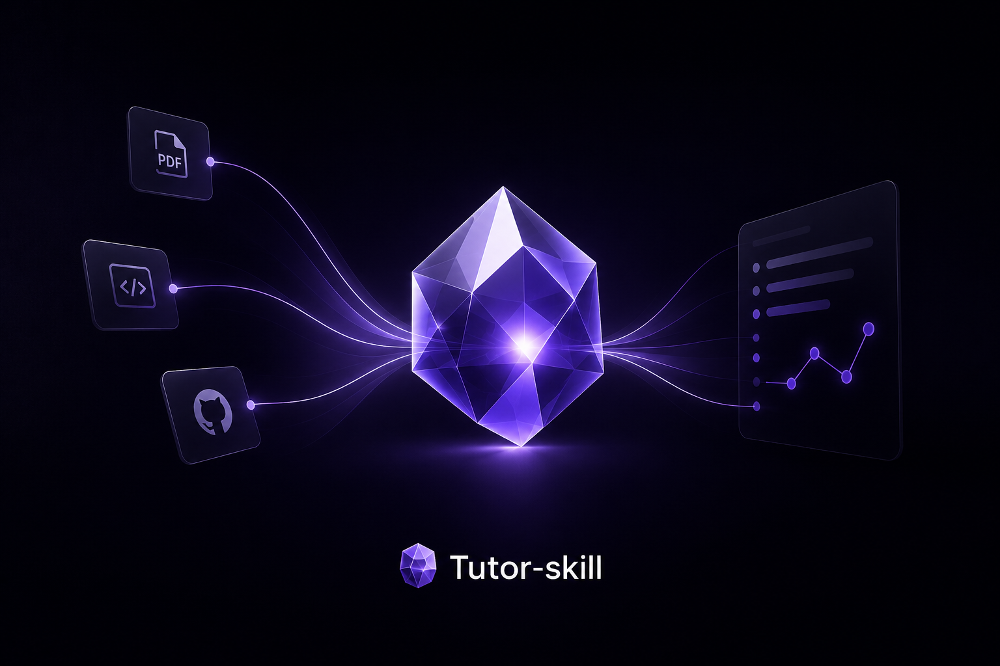
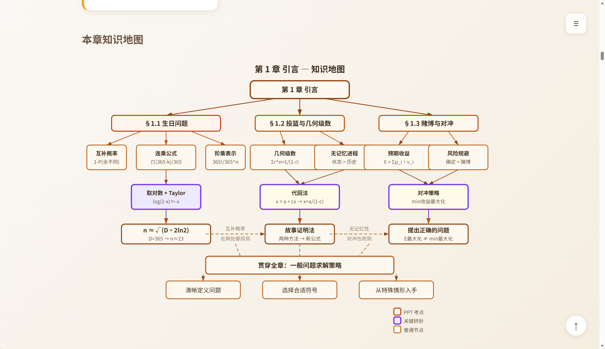
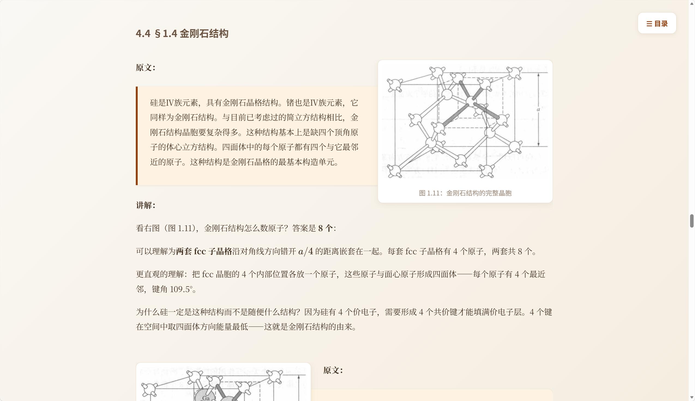

<div align="center">
  
</div>

---

<div align="right">
  <strong>English</strong> | <a href="#中文">中文</a>
</div>

# Tutor Skill

> A deep-reading tutor for Claude Code — turns any textbook or PPT into a self-contained HTML courseware.

### Screenshots

<table>
<tr>
<td></td>
<td></td>
</tr>
</table>

## What It Is

A Claude Code Skill. Drop your materials (PDF / scanned pages / MinerU-exported Markdown) into `raw/`, trigger with a slash command, and it will:

1. **Exhaust every knowledge point** — footnotes, sidebars, nothing is skipped
2. **Derive from first principles** — not "memorize the formula," but "understand why this formula must exist"
3. **Close-read the original** — quote a passage, then explain it, interleaving text and figures
4. **Feynman stress-test** — re-explain in plain language, then self-debunk
5. **Socratic questioning** — 4–8 application questions, not recall questions
6. **Closed-loop verification** — close the book, write 3 core takeaways, verify genuine understanding

The output is a **self-contained HTML file** — open it in any browser, zero build tools, zero local server.

## Why Use It

| Pain Point | How Tutor Skill Solves It |
|---|---|
| Can't retain what you read | Seven-phase structure forces deep processing, not passive scanning |
| AI lectures read like PPT slides | 25 hard rules + Forbidden List + Slop Test to prevent AI slop |
| Don't know how far you've gotten | Verification Checkpoint lists all facts before starting |
| Understand but can't solve problems | §2 reverse-engineers abilities from examples; §6 Socratic validates |
| AI fabricates citations | `/tutor verify` cross-checks courseware vs source line by line |
| Every chapter looks the same | 3 templates (concept / derivation / comparison) with distinct palettes |

### Design Principles

- **Pacing follows the book** — chapter order, concept introduction order mirrors the source
- **Content can go beyond the book** — supplementary material uses blue callout boxes, never mixed with cited text
- **Diagrams ARE content** — Mermaid for auto-layout + SVG for precision, chosen per scenario
- **Re-read every time** — the agent never relies on memory; each phase re-reads its methodology file
- **Batch generation** — no more than 3 phases per turn to avoid context overflow

---

## Quick Start

### 1. Place Your Materials

```
your-project/
├── raw/                  ← put textbooks / PPT / handouts here
│   ├── ch3-gravity.md    (MinerU-exported Markdown)
│   ├── ch3-gravity/      (companion images)
│   └── lecture-ch3.pdf
├── output/               ← courseware lands here
├── notes/                ← your own study notes (optional)
└── (tutor-skill files live here)
```

### 2. Install the Skill

Place the `tutor-skill` directory under `~/.claude/skills/`, or use it directly in your project.

### 3. Trigger a Command

In Claude Code, type `/tutor` followed by your intent:

```
/tutor lecture chapter 3
/tutor lecture chapter 3 Gravitational Force
/tutor quiz
/tutor verify latest courseware
```

The system auto-detects your intent and enters the corresponding mode (lecture, quiz, or verify).

---

## Commands

### `/tutor lecture` — Teach a Chapter

Pulls material from `raw/` and generates an HTML courseware through the seven-phase pipeline.

**Usage:**

```
/tutor lecture                              # no args → asks which chapter
/tutor lecture chapter 3                    # specify chapter
/tutor lecture chapter 3 Gravitational Force # specify chapter + topic
```

**Pipeline:**

```
Opening Ritual → Read Core Module → Choose Template → Verification Checkpoint
→ §1 Knowledge Checklist → §2 Reverse Objectives → §3 First Principles (Why)
→ §4 Close Reading (What + How) → §5 Feynman Explanation
→ §6 Socratic Questioning → §7 Closed-Loop Verification → Quality Self-Check → Output
```

**Output:** `output/<book>__<topic>.html`

---

### `/tutor quiz` — Generate Questions from Existing Courseware

Generates Socratic-style practice questions directly from a previously created courseware, no re-lecture needed.

**Usage:**

```
/tutor quiz                                   # from latest courseware
/tutor quiz from ch3__gravitational-force      # specify courseware
```

**Output:** `output/<courseware>__quiz.html`

**Question characteristics:**
- All are **application questions** — scenario + calculation, never "define X"
- Progressive difficulty — Q1 hits the core, Q2 hits details, Q3+ boundary cases
- Collapsible answers via `<details>`, think before you peek
- Each answer includes **wrong-answer pattern analysis** — "if you answered X, you confused Y with Z"
- At least one "deliberate trap" question

---

### `/tutor verify` — Verify Courseware Accuracy

Line-by-line comparison of citations, formulas, image paths in the courseware vs `raw/` source. Fixes errors in place.

**Usage:**

```
/tutor verify                                # verify latest
/tutor verify ch3__gravitational-force        # verify specific courseware
```

**Checks:**

| What | How |
|---|---|
| Citation accuracy | Search `raw/` for matching text, fix discrepancies |
| Chapter/formula numbering | Cross-reference `raw/` directory structure |
| Image path validity | Check `` against files in `raw/` |
| Supplementary callouts tagged | Tag any untagged additions |
| LaTeX formula correctness | Fix errors |
| Missing knowledge points | Flag omissions |

**Output:** verification report + corrected HTML in place

---

## What the Courseware Looks Like

A complete HTML courseware contains 7 sections, each with a clear pedagogical purpose:

| Section | Purpose | User Experience |
|---|---|---|
| **§1 Knowledge Checklist** | Exhaustive list of all concepts / formulas / examples / figures, PPT exam points marked with 🎯 | Big picture — know exactly how much there is |
| **§2 Reverse Objectives** | Work backwards from examples to 3–6 "what you can do after this" | Goal-driven — not "what to learn," but "what you can do" |
| **§3 First Principles** | Full derivation chain from motivation to concept birth | Why this concept had to be invented |
| **§4 Close Reading** | Quote → explain, formula derivation, examples and counter-examples | What it is, how to compute, how to use |
| **§5 Feynman Explanation** | Plain-language analogy + discrepancy checklist | Stress test — real understanding or superficial |
| **§6 Socratic Questioning** | 4–8 application questions, collapsible answers | Active recall, expose logical gaps |
| **§7 Closed-Loop Verification** | Close the book, write 3 core points | Active output, verify genuine understanding |

### Three Templates

Auto-selected based on content type:

| Template | For | Palette | Structure |
|---|---|---|---|
| `concept-lesson.html` | Definitions, classifications, properties | Warm (amber + tan) | §1 card grid, §3 horizontal flow |
| `proof-walkthrough.html` | Theorem proofs, formula derivations | Cool (indigo + silver) | §1 compact single-column, §3 vertical step flow |
| `comparison.html` | Method comparison, concept disambiguation | Contrast (blue-green pair) | §1 dual-column, §3 comparison table |

### Visual Features

- Light/dark mode support (`prefers-color-scheme`)
- KaTeX math rendering (inline `$...$`, block `$$...$$`)
- Mermaid auto-layout diagrams (knowledge maps) + SVG precision control (derivation chains)
- Sticky table of contents (desktop, right-side floating)
- Four callout types: supplement (blue), PPT exam point (orange), warning (red), key insight (purple)
- Three depth layers: hero / elevated / recessed
- Staggered fade-in animations (respects `prefers-reduced-motion`)
- Responsive + print-optimized

### Diagram Rendering

| Scenario | Renderer | Why |
|---|---|---|
| §1 Knowledge map (<15 nodes) | Mermaid | 10 lines of code, auto-layout |
| §1 Knowledge map (15+ nodes) | SVG | Mermaid overlaps with many nodes |
| §3.4 Concept positioning | Mermaid | Strength in hierarchical diagrams |
| §3.3 Derivation chain | SVG | Precise control over each step's position |
| §4 Example walkthrough | SVG | Each step needs exact layout control |

---

## Directory Structure

```
tutor-skill/
├── SKILL.md                        Orchestrator: commands + Step 0–6 workflow
├── package.json                    npm dependencies (beautiful-mermaid)
│
├── core/                           Core rules
│   ├── rules.md                    Hard rules + Forbidden List (17 items) + Slop Test
│   ├── phases.md                   Seven-phase definitions + quality criteria
│   └── vsl-principles.md           VSL design principles
│
├── methods/                        Teaching methodology
│   ├── first-principles.md         First-principles derivation (Phase 3)
│   ├── reverse-learning.md         Reverse learning (Phase 2)
│   ├── socratic.md                 Socratic questioning (Phase 6)
│   └── feynman.md                  Feynman technique (Phase 5)
│
├── renderers/                      Rendering specs
│   ├── html-shell.md               HTML design system (CSS variables, callouts, depth, animations)
│   ├── svg.md                      SVG drawing spec
│   └── mermaid.md                  Mermaid rendering guide
│
├── scripts/                        Executable scripts
│   └── render-mermaid.mjs          Mermaid → SVG CLI renderer
│
├── templates/                      HTML templates by content type
│   ├── concept-lesson.html         Concept-based (warm palette)
│   ├── proof-walkthrough.html      Proof-based (cool palette)
│   └── comparison.html             Comparison-based (blue-green pair)
│
├── commands/                       Slash commands (dispatched by SKILL.md)
│   ├── lesson.md                   /tutor lecture
│   ├── quiz.md                     /tutor quiz
│   └── fact-check.md               /tutor verify
│
└── assets/                         Preset resources
    └── screenshots/                Demo screenshots
```

---

## Quality Assurance

### Forbidden List (17 Hard Prohibitions)

Three layers of control:

**Style (7 items)** — ban AI-speak patterns:
- "Not X but Y" contrast sentence structure, filler adverbs like "steadily/firmly/properly," motivational openings like "let's dive in together," decorative emoji, "obviously/trivially" to skip steps…

**Visual (4 items)** — ban cheap visuals:
- Gradient text, emoji as headings, animation glows, one palette for all templates

**Content (6 items)** — ban teaching shortcuts:
- Definition without example, example without counter-example, skipping prerequisites, hollow analogies, explaining jargon with jargon, comparison tables outside §5

### Slop Test

After writing, ask three questions:
1. Can a student solve the textbook exercises using the courseware? No = fail.
2. Does the original content stand alone after removing callouts? No = over-reliance on source.
3. Would a peer think "this was mass-produced by AI"? Yes = lazy design.

### Execution Rules

- No more than 3 phases per turn; batch generation
- Each phase must re-read its methodology file before starting
- Verification Checkpoint and Quality Self-Check must be output item by item — no skipping

---

## Use Cases

- **Students**: Turn textbook chapters into interactive, self-quizzing courseware
- **Exam prep**: Combine PPT and past papers into exam-focused review material
- **Self-learners**: Any subject works — math, physics, engineering, programming, humanities, arts, languages
- **Teachers**: Quickly generate lecture handouts, save prep time

## Requirements

- Claude Code (or a compatible AI coding agent)
- Node.js (for Mermaid diagram rendering; `beautiful-mermaid` auto-installs on first use)
- A browser (to view the HTML courseware)

## License

[MIT](LICENSE)

---

<div id="中文"></div>

<div align="right">
  <a href="#tutor-skill">English</a> | <strong>中文</strong>
</div>

# Tutor Skill

> 深度精读式助教——把一本书或一套 PPT 讲透，输出自包含 HTML 课件。

### 效果截图

<table>
<tr>
<td></td>
<td></td>
</tr>
</table>

## 它是什么

一个 Claude Code Skill。你把教材（PDF/扫描件/MinerU 转出的 markdown）放进 `raw/`，用斜杠命令触发，它会：

1. **穷尽知识点**——连脚注和边栏都不放过
2. **从第一性原理推导**——不是"记住公式"，是"理解为什么必须有这个公式"
3. **逐字精读原书**——引一段讲一段，图文交织
4. **费曼讲法压测**——用大白话再讲一遍，然后自我打假
5. **苏格拉底出题**——4-8 道使用题，不是背诵题
6. **闭环验真**——合上书写 3 个核心点，检验有没有真懂

输出是一个**自包含的 HTML 文件**，浏览器打开即读，零构建工具，零本地服务器。

## 为什么用它

| 痛点 | Tutor Skill 怎么解决 |
|---|---|
| 读书记不住 | 七阶段结构强制深度加工，不是被动扫读 |
| AI 讲课像念 PPT | 25 条硬性规则 + Forbidden 列表 + Slop Test 防止 AI 味 |
| 不知道学到哪了 | Verification Checkpoint 先列事实清单再开讲 |
| 看懂了但不会做题 | §2 逆向目标从例题倒推能力，§6 苏格拉底用题验证 |
| AI 会编造引用 | `/tutor 校验` 逐条校验课件 vs 原文 |
| 不同内容长得一样 | 3 套模板（概念/推导/对比）各有独立色板和结构 |

### 设计原则

- **节奏贴着书走**——章节顺序、概念引入次序跟着原书脉络
- **内容不必只来自书**——书外拓展用蓝色 callout 标出，不混入原文引用
- **图即内容**——Mermaid 自动生成布局 + SVG 精确控制，按场景选择
- **每次重新读**——agent 不凭记忆，每个 Phase 前都读对应方法论文件
- **分批生成**——单次不超 3 个 Phase，避免上下文爆满

---

## 快速开始

### 1. 放置材料

```
你的项目/
├── raw/                  ← 把书/PPT/讲义放这里
│   ├── ch3-万有引力.md   （MinerU 转出的 markdown）
│   ├── ch3-万有引力/     （配套图片）
│   └── 课程PPT-第三章.pdf
├── output/               ← 课件输出到这里
├── notes/                ← 你的理解笔记（可选）
└── （tutor-skill 文件自动在此）
```

### 2. 安装 Skill

将 `tutor-skill` 目录放到 `~/.claude/skills/` 下，或在项目中直接使用。

### 3. 触发命令

在 Claude Code 中输入 `/tutor`，然后说明你要做什么：

```
/tutor 讲第3章
/tutor 讲第3章 万有引力定律
/tutor 出题
/tutor 校验最新课件
```

系统会自动识别你的意图，进入对应模式（讲课、出题、校验）。

---

## 命令详解

### `/tutor 讲课` — 讲一章课

从 raw/ 取材，按七阶段流程生成 HTML 课件。

**用法：**

```
/tutor 讲课                            # 不带参数，会问你讲哪章
/tutor 讲第3章                         # 指定章节
/tutor 讲第3章 万有引力定律              # 指定章节+主题
```

**流程：**

```
开场仪式 → 读核心模块 → 选模板 → Verification Checkpoint
→ §1 知识清单 → §2 逆向目标 → §3 第一性原理（Why）
→ §4 逐字精读（What+How）→ §5 费曼讲法
→ §6 苏格拉底诘问 → §7 闭环验真 → 质量自查 → 输出
```

**输出：** `output/<书名>__<主题>.html`

---

### `/tutor 出题` — 从已有课件出题

不重新讲课，直接从已生成的课件提取知识点，出苏格拉底式练习题。

**用法：**

```
/tutor 出题                              # 从最新课件出题
/tutor 从 ch3__万有引力定律 出题            # 指定从哪个课件出题
```

**输出：** `output/<课件名>__quiz.html`

**题目的特点：**
- 全部是**使用题**——给情境、算结果，不是"X 的定义是什么"
- 难度递进——Q1 戳核心 → Q2 戳细节 → Q3+ 边界/反例
- 每题用 `<details>` 折叠答案，先自己想再看
- 每题答案包含**错答模式分析**——告诉你"如果你答错的是 X，那是因为你把 Y 和 Z 混了"
- 至少一道"故意挖坑"题

---

### `/tutor 校验` — 校验课件准确性

逐条对比课件中的引用、公式、图片路径 vs raw/ 原文，就地修正错误。

**用法：**

```
/tutor 校验                             # 校验最新课件
/tutor 校验 ch3__万有引力定律             # 校验指定课件
```

**校验项：**

| 校验内容 | 处理方式 |
|---|---|
| 原文引用是否准确 | 对比 raw/ 搜索对应文字，修正差异 |
| 章节号/公式编号 | 对照 raw/ 目录结构，修正编号 |
| 图片路径是否有效 | 检查 `` 对应 raw/ 中的文件 |
| 书外补充/PPT 考点是否标了 callout | 未标的补上 |
| 公式 LaTeX 是否正确 | 修正错误 |
| 知识点是否遗漏 | 标记遗漏项 |

**输出：** 校验报告 + 就地修正后的 HTML

---

## 课件长什么样

一个完整的 HTML 课件包含 7 个章节，每个都有明确的教学功能：

| 章节 | 做什么 | 用户体验 |
|---|---|---|
| **§1 知识点清单** | 穷尽本章所有概念/公式/例题/图，PPT 考点标 🎯 | 全局视野——知道这章有多少东西 |
| **§2 逆向目标** | 从例题倒推 3-6 条"学完能做到什么" | 目标驱动——不是"要学什么"，是"能干什么" |
| **§3 第一性原理** | 从动机到概念诞生的完整推导链 | 为什么必须发明这个概念 |
| **§4 逐字精读** | 引一段讲一段，公式推导，正例反例 | 具体是什么、怎么算、怎么用 |
| **§5 费曼讲法** | 大白话类比 + 差异清单 | 压力测试——真懂还是假懂 |
| **§6 苏格拉底** | 4-8 道使用题，折叠答案 | 主动回忆，暴露逻辑漏洞 |
| **§7 闭环验真** | 合上书写 3 个核心点 | 主动输出，检验是否真懂 |

### 三套模板

根据内容类型自动选择：

| 模板 | 适用 | 色板 | 结构特点 |
|---|---|---|---|
| `concept-lesson.html` | 概念定义、分类、性质 | 暖色（琥珀+棕褐） | §1 卡片网格，§3 水平推导流 |
| `proof-walkthrough.html` | 定理证明、公式推导 | 冷色（靛蓝+银灰） | §1 紧凑单列，§3 纵向步骤流 |
| `comparison.html` | 方法对比、概念辨析 | 对比色（蓝绿对） | §1 双列清单，§3 对比表 |

### 视觉特性

- 支持亮色/暗色模式（`prefers-color-scheme`）
- KaTeX 渲染数学公式（行内 `$...$`，块级 `$$...$$`）
- Mermaid 自动生成图表布局（知识地图、概念定位图），SVG 精确控制（推导链、过程图）
- 粘性目录导航（桌面端右侧浮动）
- 四种 callout：书外补充（蓝）、PPT 考点（橙）、警告（红）、关键转折（紫）
- 三层深度卡片：hero / elevated / recessed
- 交错淡入动画（尊重 `prefers-reduced-motion`）
- 响应式 + 打印优化

### 图表渲染

| 场景 | 渲染方式 | 为什么 |
|---|---|---|
| §1 知识地图（<15 节点） | Mermaid | 10 行代码自动生成布局 |
| §1 知识地图（15+ 节点） | SVG | 节点多时 Mermaid 布局会重叠 |
| §3.4 概念定位图 | Mermaid | 层级关系图的强项 |
| §3.3 推导链 | SVG | 精确控制每步位置和高亮 |
| §4 例题过程图 | SVG | 每步布局需要精确控制 |

---

## 目录结构

```
tutor-skill/
├── SKILL.md                        编排层：命令列表 + Step 0-6 工作流
├── package.json                    npm 依赖（beautiful-mermaid）
│
├── core/                           核心规则
│   ├── rules.md                    硬性规则 + Forbidden 列表（17 条）+ Slop Test
│   ├── phases.md                   七阶段定义 + 每阶段质量标准
│   └── vsl-principles.md           VSL 设计原则
│
├── methods/                        教学方法论
│   ├── first-principles.md         第一性原理推导（Phase 3）
│   ├── reverse-learning.md         逆向学习法（Phase 2）
│   ├── socratic.md                 苏格拉底诘问（Phase 6）
│   └── feynman.md                  费曼讲法（Phase 5）
│
├── renderers/                      渲染规范
│   ├── html-shell.md               HTML 设计系统（CSS 变量、callout、深度层级、动画）
│   ├── svg.md                      SVG 制图规范
│   └── mermaid.md                  Mermaid 渲染指南
│
├── scripts/                        可执行脚本
│   └── render-mermaid.mjs          Mermaid → SVG 渲染 CLI
│
├── templates/                      按内容类型区分的 HTML 模板
│   ├── concept-lesson.html         概念讲解型（暖色系）
│   ├── proof-walkthrough.html      证明推导型（冷色系）
│   └── comparison.html             对比分析型（蓝绿对）
│
├── commands/                       斜杠命令（由 SKILL.md 分发）
│   ├── lesson.md                   /tutor 讲课
│   ├── quiz.md                     /tutor 出题
│   └── fact-check.md               /tutor 校验
│
└── assets/                         预置资源
    └── screenshots/                效果截图
```

---

## 质量保障

### Forbidden 列表（17 条硬性禁止）

分三层把关：

**文风层**（7 条）——禁止 AI 味句式：
- "不是 X 而是 Y"对偶句式、"稳稳/牢牢/妥妥"等副词、"让我们一起"煽动开场、装饰性 emoji、"显然/易得"跳步……

**视觉层**（4 条）——禁止廉价视觉：
- 渐变文字、emoji 做标题、动画光晕、所有模板用同一个色板

**内容层**（6 条）——禁止教学偷懒：
- 只给定义不给例子、只给例子不给反例、跳过前置知识、空洞类比、用术语解释术语、§5 差别表是唯一允许的对比表格

### Slop Test（AI 味检测）

写完后自问三个问题：
1. 学生能用课件做对原书习题？不能 = 不达标
2. 删掉 callout 后原书内容能独立成章？不能 = 对原书依赖过重
3. 同行看到会不会觉得"这是 AI 批量生产的"？会 = 设计偷懒了

### 执行规则

- 单次输出不超 3 个 Phase，分批生成
- 每个 Phase 前必须重新读对应方法论文件
- Verification Checkpoint 和 Quality Self-Check 必须逐条输出，不能跳过

---

## 适用场景

- **学生**：把教材章节变成可交互的精读课件，附带练习题
- **考研/考公**：配合 PPT 和真题，生成考点明确的复习材料
- **自学者**：任何领域的书都能讲——数学物理、工程编程、人文社科、艺术语言
- **教师**：快速生成课堂讲义，节省备课时间

## 系统要求

- Claude Code（或兼容的 AI coding agent）
- Node.js（用于 Mermaid 图表渲染，`beautiful-mermaid` 首次使用自动安装）
- 浏览器（查看 HTML 课件）

## 许可证

[MIT](LICENSE)
