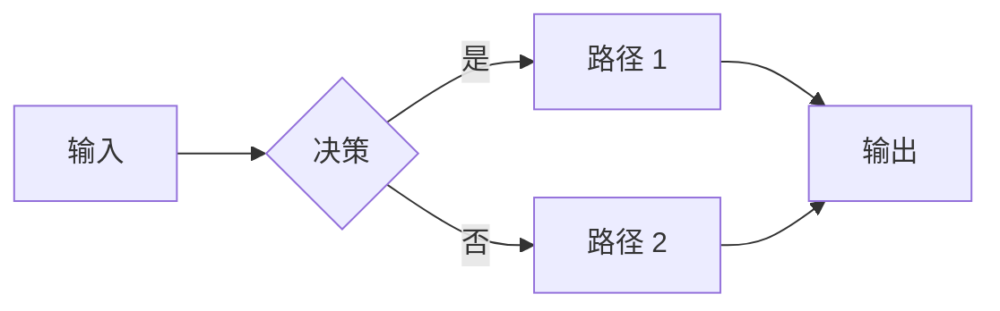
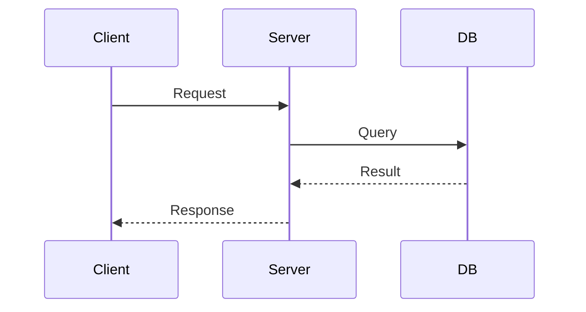
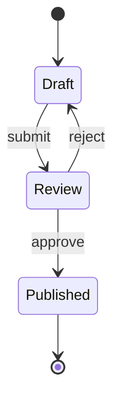
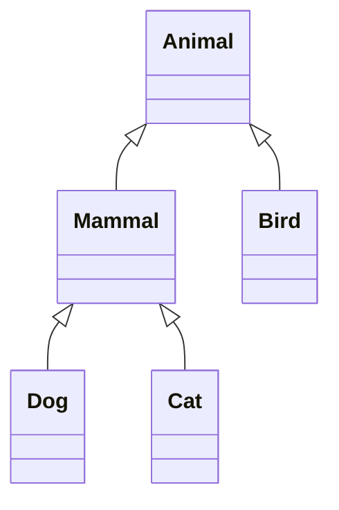

# 流程图制作指南

凡课件里出现"流程 / 步骤 / 层级 / 对照 / 状态 / 时序 / 调用 / 数据流"这一类"多元素+关系"的描述，都要配图。本文件给出三种工具的选择标准、模板、反例。

## 1. 决策树：用什么？

```text
 节点 ≤ 7 个，且关系是线性 / 简单分支 / 表格对照？
   └─ 是 → ASCII
   └─ 否 ↓
 关系是流程 / 状态 / 时序 / 类层级？
   └─ 是 → Mermaid
   └─ 否 ↓
 涉及空间几何 / 带标注示意 / 矢量数学？
   └─ 是 → SVG
   └─ 否 → 重新审视：真的需要图吗？
```

优先级：**ASCII > Mermaid > SVG**。能用上一级就用上一级——可移植性、可编辑性、token 经济性都更好。

## 2. ASCII 模板库

### 2.1 线性流程

```text
 输入 ──> [处理 1] ──> [处理 2] ──> 输出
```

### 2.2 分支

```text
              ┌──> 路径 A
 [决策点] ────┤
              └──> 路径 B
```

### 2.3 树形 / 层级

```text
 根概念
 ├── 子概念 A
 │   ├── 孙 A1
 │   └── 孙 A2
 └── 子概念 B
     └── 孙 B1
```

### 2.4 对照表（同名表亲辨析专用）

```text
              │  KV cache              │  CPU cache
 ─────────────┼────────────────────────┼──────────────────────
 学科         │  深度学习              │  计算机体系结构
 子领域       │  Transformer 推理       │  内存层次
 直接动机     │  避免重算 K/V 张量      │  弥补 CPU↔RAM 速度差
 替换策略     │  几乎不替换             │  LRU / LFU
 单位         │  张量                  │  字节
```

### 2.5 状态机

```text
 [draft] ──submit──> [review] ──approve──> [published]
    ^                    │
    └─────reject─────────┘
```

### 2.6 分层架构

```text
 ┌────────────────────────────┐
 │  Application                │
 ├────────────────────────────┤
 │  Transport (TCP/UDP)        │
 ├────────────────────────────┤
 │  Network (IP)               │
 ├────────────────────────────┤
 │  Link                       │
 └────────────────────────────┘
```

### 2.7 时间轴

```text
 1687 ────── 1812 ────── 1905 ────── 1925 ──>
   ↑           ↑           ↑           ↑
 牛顿       拉普拉斯     爱因斯坦    矩阵力学
```

### 2.8 推导链（§3.3 标配）

```text
 假设 1：<...>  ──┐
                  ├──推出──> 中间结论 1 ──┐
 假设 2：<...>  ──┘                       │
                                           ├──推出──> 公式 (X.Y)
 假设 3：<...>  ──────推出──> 中间结论 2 ──┘
```

### 2.9 对比图（有 vs 没有 / 改进前 vs 改进后）

当要解释一个优化、改进、或设计决策时，把"没有它"和"有了它"并排画出来，差异一目了然：

```text
 【没有 KV cache】                  【有 KV cache】

 t1 ──> 算 K1,V1                   t1 ──> 算 K1,V1 ──> 存入 cache
 t2 ──> 重算 K1,V1, 算 K2,V2       t2 ──> 读 cache,   算 K2,V2 ──> 存入
 t3 ──> 重算 K1,V1,K2,V2, 算 K3,V3 t3 ──> 读 cache,   算 K3,V3 ──> 存入
       ↑                                  ↑
    每步重复量线性增长               每步只算新的一个
    O(n²) 总计算量                   O(n) 总计算量
```

要点：左右两列结构对齐、同一行对应同一步骤、差异用文字标注在底部。读者扫一眼就能看出区别在哪。

### ASCII 注意事项

- **必须放在 fenced code block 里**（` ```text ` 或 ` ``` `），否则 markdown 会吞掉空格、破坏对齐。
- 统一用 box-drawing 字符 `─ │ ┌ ┐ └ ┘ ├ ┤ ┬ ┴ ┼`，不要和 `-` `|` `+` 混着用。
- 中英文混排：中文字符是全宽（占 2 列），英文 / 数字是半宽（占 1 列）。等宽字体下按这个算，对齐就稳。
- 节点超过 7 个 → 换 Mermaid。

## 3. Mermaid 快速参考

Obsidian 原生支持 ` ```mermaid ` 代码块，零配置。

### 3.1 流程图

````text

````

要点：
- `flowchart LR`：从左到右；`TD`：从上到下
- `A[文本]` 方框；`A(文本)` 圆角；`A{文本}` 菱形决策；`A((文本))` 圆形
- `A --> B` 实线；`A -.-> B` 虚线；`A -->|标签| B` 带标签

### 3.2 时序图

````text

````

### 3.3 状态机

````text

````

### 3.4 类 / 概念层级

````text

````

### Mermaid 注意事项

- **节点 ID 不能用中文**（label 可以中文，ID 用 A B C 或英文短词）。
- 标签里的 `()` `:` `"` 经常踩雷，如果渲染失败先排查这些。
- 写完贴进 Obsidian 看一眼再继续——失败时报错信息只有一行很难定位。

## 4. SVG 内嵌

仅当 ASCII 和 Mermaid 都不够用时（空间几何、带精确标注的图、向量场之类）才用。SVG 直接写进 md，Obsidian 原生渲染。

最小可用模板（直角三角形 + 标注）：

```html
<svg viewBox="0 0 300 220" xmlns="http://www.w3.org/2000/svg">
  <!-- 三角形 -->
  <polygon points="50,180 50,60 230,180"
           fill="none" stroke="black" stroke-width="2"/>
  <!-- 直角标记 -->
  <polyline points="50,170 60,170 60,180"
            fill="none" stroke="black"/>
  <!-- 边长标注 -->
  <text x="25" y="125" font-size="16">a</text>
  <text x="135" y="200" font-size="16">b</text>
  <text x="155" y="115" font-size="16">c</text>
</svg>
```

要点：
- `viewBox="0 0 W H"` 决定坐标系，左上角 (0,0)，y 向下增加。
- 常用元素：`<line>`、`<rect>`、`<circle>`、`<polygon>`、`<polyline>`、`<text>`、`<path>`。
- 箭头：在 `<defs>` 里定义 `<marker>`，再在 `<line>` 上加 `marker-end="url(#arrow)"`。
- 中文：直接写在 `<text>` 里，浏览器会用默认字体；不用指定 `font-family`。

写复杂 SVG 的捷径：**先用 ASCII 把骨架画对，再翻译成 SVG 坐标**。直接写 SVG 容易在心里算崩坐标。

## 5. 反例：不要画图的情况

- 单一定义、零关系：例如"速度 = 距离 / 时间"——公式本身就是图。
- 一句话因果：例如"因为 A 所以 B"——别为画图而画图。
- 原书已经有图、且你已经嵌了原图——不要再画一个重复的简化版来"显得有图"。

## 6. Obsidian 渲染速查

| 形式 | 怎么写 | 渲染失败常见原因 |
|------|--------|------------------|
| ASCII | ` ```text ... ``` ` | 没包 fenced block，对齐被吞 |
| Mermaid | ` ```mermaid ... ``` ` | 节点 ID 是中文 / 标签里有未转义字符 |
| 内嵌 SVG | `<svg viewBox=...>` | 缺 `viewBox` 或 `xmlns` |
| 外部图片 | `` | 路径错（见 `image-handling.md`） |

每写完一份课件，在 Obsidian 里从头翻一遍，确认每张图都正常渲染。
