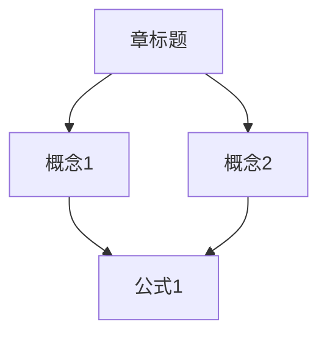

# Mermaid 渲染指南

用 Mermaid 画图，用 SVG 控制精度。两者互补，不是替代。

---

## 什么时候用 Mermaid

| 场景 | 渲染方式 | 原因 |
|---|---|---|
| §1 知识地图（<15 节点） | **Mermaid** | `flowchart TD` 自动生成布局，10 行搞定 |
| §1 知识地图（15+ 节点） | SVG | 节点太多 Mermaid 布局会重叠 |
| §3.4 概念定位图 | **Mermaid** | `flowchart TD` 层级关系图的强项 |
| §3.3 推导链（静态） | SVG | 需要精确控制每步位置和高亮区域 |
| §4 例题过程图 | SVG | 每步布局需要精确控制 |
| §6 苏格拉底 | HTML `<details>` | 不需要图表 |

**原则**：能用 Mermaid 自动生成布局的就用 Mermaid，需要精确控制的用 SVG。

---

## 渲染方式

### Agent 写 .mmd → 调 CLI → 拿到 SVG → 嵌入 HTML

```
1. agent 写 Mermaid 代码到临时文件 scripts/tmp.mmd
2. 执行: node scripts/render-mermaid.mjs --input scripts/tmp.mmd
3. stdout 输出 SVG 字符串
4. agent 把 SVG 直接粘进 HTML
5. 删除临时文件
```

也可以不写文件，直接把 Mermaid 代码通过 stdin 传入：

```bash
echo 'graph TD; A-->B' | node scripts/render-mermaid.mjs
```

### 首次使用

脚本会自动检测 `beautiful-mermaid` 是否已安装，没有就自动 `npm install`。不需要手动操作。

---

## Mermaid 语法速查

### 流程图（知识地图、概念定位图）



方向：`TD`（上到下）、`LR`（左到右）、`BT`（下到上）

节点形状：
- `[文本]` — 矩形
- `(文本)` — 圆角矩形
- `{文本}` — 菱形（判断）
- `((文本))` — 圆形
- `>文本]` — 非对称（旗帜）

连线：
- `-->` — 实线箭头
- `-.->` — 虚线箭头
- `==>` — 粗箭头
- `-- 文本 -->` — 带标签的连线

### 在 HTML 中嵌入

渲染后的 SVG 是完整字符串，直接放进 HTML：

```html
<!-- 知识地图 -->
<section id="s1">
  <h3>本章知识地图</h3>
  <!-- 这里粘贴 render-mermaid.mjs 输出的 SVG -->
</section>
```

### 与 CSS 变量配合

渲染时可以用 CSS 变量做颜色，让 SVG 自动跟随亮色/暗色模式：

```bash
node scripts/render-mermaid.mjs --input map.mmd \
  --bg "var(--bg-page)" \
  --fg "var(--text-primary)"
```

这样 SVG 的背景和前景色会随用户系统的 `prefers-color-scheme` 自动切换。

---

## 与 SVG 的分工

| 特性 | Mermaid | 手写 SVG |
|---|---|---|
| 布局 | 自动（ELK 力导向） | 手动坐标 |
| 修改成本 | 改文本即可 | 改坐标 |
| 精确控制 | 低（自动布局） | 高（每个像素） |
| 适合场景 | 拓扑关系、流程 | 推导链、过程图 |
| 代码量 | 10-20 行 | 50-100+ 行 |

**规则**：拓扑类图（谁包含谁、谁依赖谁）用 Mermaid，精确布局图（推导步骤、过程流程）用 SVG。
